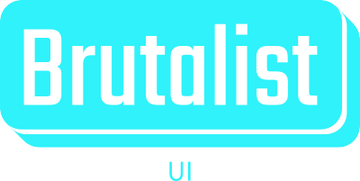

# [WIP] Brutalist UI Library

<p align='center'>
 
</p>
Welcome to Brutalist UI, a unique and striking UI component library that embraces the Brutalist design style. If you're looking to break away from the conventional and explore a bold and unapologetic design philosophy, Brutalist UI is here to help you do just that.

## Table of Contents

- [Introduction](#brutalist-ui-library)
- [Getting Started](#getting-started)
- [Installation](#installation)
- [Usage](#usage)
- [Components](#components)
- [Customization](#customization)
- [Contributing](#contributing)
- [License](#license)

## About Brutalist Design

Brutalism is a design movement that emerged in the mid-20th century, characterized by its raw, rugged, and often austere aesthetic. It embraces simplicity, functionality, and an honesty of materials, creating designs that are both provocative and utilitarian. Brutalism stands in stark contrast to the polished, sleek, and highly stylized interfaces that dominate the digital landscape today.

## Features

- A collection of UI components inspired by Brutalist design principles.
- Built using modern technologies including Vite, Vitest, React, Storybook, and Sass for a seamless development experience.
- Highly customizable, allowing you to tailor the components to your specific project needs.
- Comprehensive documentation and examples to help you get started quickly.

## Getting Started

To start using Brutalist UI in your project, follow the installation instructions provided below.

## Installation

You can install Brutalist UI via npm or yarn. Simply run:

```bash
npm install @fiercemonkey/brutalist-ui
# or
yarn add @fiercemonkey/brutalist-ui
```

For detailed installation instructions and package options, please refer to the Installation Guide.

## Usage

Brutalist UI is easy to integrate into your React applications. To begin using our components, follow the steps outlined in the Usage Guide.

## Components

Explore the diverse range of Brutalist-inspired UI components available in this library by visiting our Components Guide. From buttons to forms and navigation elements, you'll find everything you need to create unique and captivating user interfaces.

## Customization

We understand that the Brutalist style may not be a perfect fit for every project. That's why Brutalist UI is highly customizable. You can adjust the components to match your project's specific requirements. Find out more about customization in our Customization Guide.

## Contributing

We welcome contributions from the open-source community. If you'd like to get involved in making Brutalist UI even better, please review our Contribution Guidelines.

## License

Brutalist UI is released under the MIT License, so you can use it in your projects with confidence.

Thank you for choosing Brutalist UI! We hope you find our library a refreshing departure from the mainstream, and we look forward to seeing the unique and innovative designs you create with it. If you have any questions, issues, or suggestions, please don't hesitate to reach out to our friendly and passionate community. Happy Brutalist designing!
